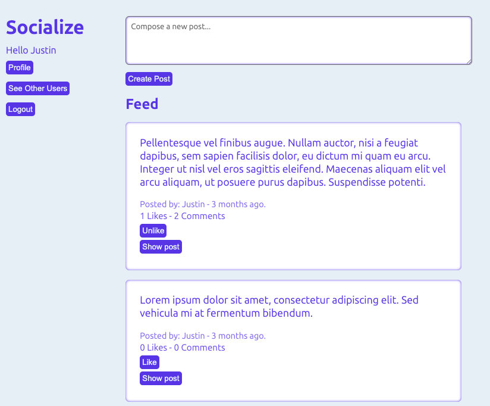

# Socialize

A Facebook-style social media site built with Ruby on Rails.

## Features
- Account creation via Devise
- Create, Edit, Destroy posts
- Likes
- Comment creation
- Following other users
- Testing via Rspec

## Run Locally
- Clone this repository
- Navigate to the project directory
- Run `bundle install`
- Run `rails db:migrate` to setup the database
- Run `rails s` to start server
- Visit https://localhost:3000 to view the app in the browser
